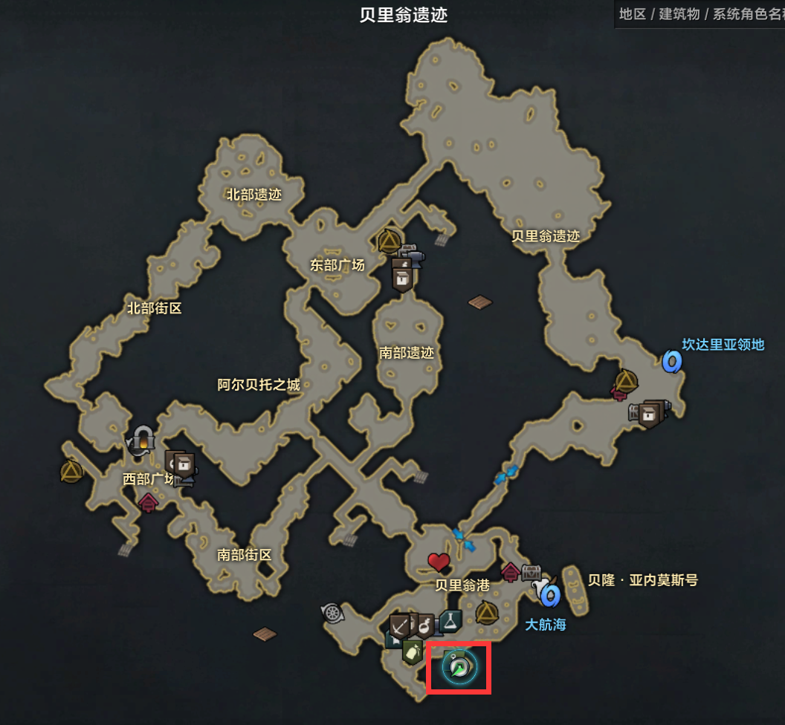
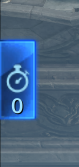
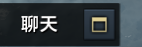

# LostArk Auto Fish

Some code are from [LostArkFishingBot](https://github.com/DamienShahan/LostArkFishingBot).

## Function

- Auto **Float Fishing**
- Auto **Net Casting** and play mini game.
- Auto **Repear** fish rod. (Beatrice's Blessing only).
- Auto accept and submit guild's fishing quest.

## Requirement

**IMPORTANT: It only works well on the fullscreen resolution of 2560x1600 now. Other resolutions should first change the x(y) variables in the code and take the corresponding screenshot.** 

- python3+
- pyautogui
- opencv-python
- PIL
- yaml

## Usage

1. Move to South Vern

2. Accept **ALL** guild task(including tasks that are not fishing task).
3. Switch to a worldline with few player.
4. Press 'B'.
5. Fold all event, quest, chat window. Like this.
   
6. Alt+Tab to Desktop. Run python code: `python main.py`
7. Switch to the game window.

## Reference

DamienShahan, https://github.com/DamienShahan/LostArkFishingBot

Minish144, https://github.com/Minish144/lost-ark-fishing-bot
